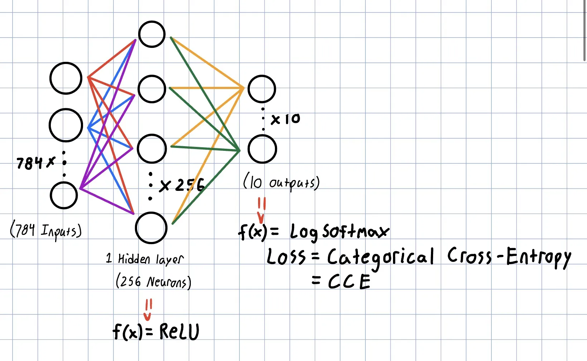

# MLP-MNIST-Digits

A follow-up to my [`mlp-xor-problem`](https://github.com/michaeltrbo/mlp-xor-problem) project — this time scaling that simple 2-input MLP into something that can recognize handwritten digits from the MNIST dataset.  
The goal: go from understanding how an MLP *thinks* to watching it solve a real pattern-recognition task.

---

## Motivation

In my XOR project, I built a neural network from scratch in NumPy — no frameworks, no shortcuts — just matrix math and the chain rule.  
That experiment made the mechanics of forward and backward propagation click.

This MNIST version is the logical next step: same fundamental math, but scaled up to 784 inputs (28×28 pixels) and 10 outputs (digits 0–9).  
It’s the exact same principles as XOR — just more neurons, more data, and a little more structure.

---

## What is MNIST?

MNIST is the “Hello World” of computer vision — a dataset of 70,000 grayscale images of handwritten digits.  
Each image is 28×28 pixels, and the goal is to correctly classify which digit (0-9) it represents.  

Conceptually:
- **XOR MLP:** 2 inputs → 1 output  
- **MNIST MLP:** 784 inputs → 10 outputs  

Both are just different-sized multilayer perceptrons (MLPs).  
The same feedforward + backpropagation process applies, only now we’re training on thousands of examples instead of four.

<p align="center">
  
  <br>
  <em>Visualization of my MLP architecture for the MNIST dataset</em>
</p>


---

## PyTorch vs NumPy

In the XOR project, I manually wrote the forward and backward passes using NumPy.  
For MNIST, I moved to **PyTorch**, which automates:
- gradient tracking (autograd)
- GPU acceleration
- data loading and batching
- built-in optimizers (Adam, SGD, etc.)

PyTorch still does the same math (matrix multiplies, nonlinear activations, gradient descent) — it just handles the logistics for you so you can focus on the architecture and experimentation.

---

## Repository Structure

```
mlp-mnist-digits/
├── MNIST/
│   └── raw/
│       ├── train-00000-of-00001.parquet   ← new Parquet dataset format
│       ├── test-00000-of-00001.parquet
│       ├── train-images-idx3-ubyte(.gz)   ← original dataset files
│       ├── train-labels-idx1-ubyte(.gz)
│       ├── t10k-images-idx3-ubyte(.gz)
│       └── t10k-labels-idx1-ubyte(.gz)
│
├── mnist_openvino_model/
│   ├── best_model.xml / best_model.bin     ← OpenVINO IR (best model)
│   └── last_model.xml / last_model.bin     ← OpenVINO IR (last epoch)
│
├── train.py              ← base PyTorch MLP training script
├── train_optimized.py    ← improved version using parquet + dropout + val tracking
└── inference.py          ← OpenVINO + Tkinter GUI for live digit recognition
```

---

### Training Scripts: `train.py` vs `train_optimized.py`

There are two versions of the training script, depending on your hardware setup:

- **`train.py`** → The baseline version that runs entirely on CPU.  
  Ideal for systems without a CUDA-capable GPU or when you just want a simple, portable version of the training loop.

- **`train_optimized.py`** → The faster, GPU-accelerated version designed for machines with NVIDIA GPUs.  
  It uses CUDA for parallel tensor operations, enabling significantly faster training.  
  This script also includes a few extra optimizations like Parquet data loading and dropout for better performance and generalization.

In short:  
If you’re running on a laptop or desktop **without** a dedicated GPU — use `train.py`.  
If you’ve got a **CUDA GPU** (like an RTX 4050) — go with `train_optimized.py` for a major speed boost.

---

## Training

Make sure you have PyTorch and torchvision installed.  
GPU build (recommended):
```bash
pip install torch torchvision --index-url https://download.pytorch.org/whl/cu121
```

Then run:
```bash
python train_optimized.py
```

This will:
- Load the MNIST dataset (from local `.ubyte` or `.parquet`)
- Train an MLP on your **RTX 4050 GPU**
- Save both the `best_model.xml/.bin` and `last_model.xml/.bin` for OpenVINO

---

## Inference (NPU + OpenVINO)

After training, you can run the model on Intel’s NPU using OpenVINO:

```bash
python inference.py
```

This launches a Tkinter window where you can draw a digit and watch the model classify it live — all running through the **Intel NPU backend**.  

Under the hood:
- The trained PyTorch model is converted to OpenVINO IR
- OpenVINO’s runtime compiles it for the **NPU**
- Inference runs locally with near-instant response time

---

## Hardware Acceleration

- **Training:** NVIDIA RTX 4050 (CUDA)  
- **Inference:** Intel NPU via OpenVINO  
  This hybrid setup takes advantage of both platforms — GPU for learning, NPU for deployment.  
  It’s the same pipeline you’d see in a modern edge-AI workflow.

---

## Takeaways

- MNIST isn’t about accuracy anymore — it’s about understanding the *pipeline*.
- The XOR problem was the foundation. MNIST just adds scale and automation.
- PyTorch and OpenVINO together make the jump from “toy network” to “real deployable model” surprisingly seamless.
- The NPU runtime gives you hardware-level inference efficiency that’s genuinely useful for embedded or laptop AI apps.

---

## Next Steps

- Add a **CNN layer** to improve accuracy and performance.
- Experiment with **quantization** (INT8) in OpenVINO.
- Try exporting the model to **ONNX** and deploying to a Jetson or Raspberry Pi.
- Build a small **.exe app** around the Tkinter interface for easier demos.

---

*From XOR to MNIST — same math, bigger world.*
